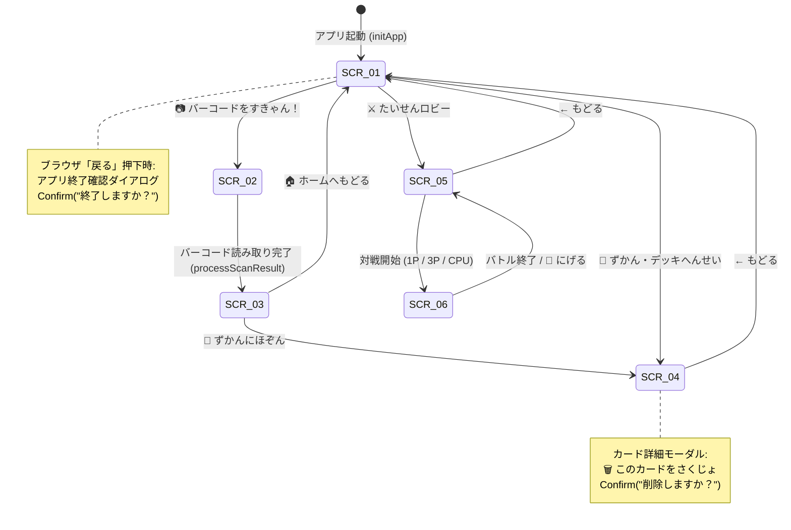

# 📐 バーコードバトラー (Barcode Battler) - 基本設計書 (Basic Design Document)

**ドキュメントバージョン**: v2.2.0 (正式版)  
**最終更新日**: 2026年8月15日  
**ステータス**: 正式リリース・設計同期完了 (Synchronized with Codebase)  
**公開URL**: `https://bigshine0328.github.io/barcode-battler/`

---

## 1. システムアーキテクチャ概要

本システムは、完全フロントエンド完結型のシングルページアプリケーション（SPA）として構築されており、WebRTC P2Pプロトコルによる分散リアルタイム通信対戦を実現しています。

```
+-----------------------------------------------------------------------------------+
|                                  Client Browser                                   |
|                                                                                   |
|   +---------------------------------------------------------------------------+   |
|   |                        UI / Router (HTML5 & Vanilla CSS)                  |   |
|   |   SCR-01 (Home) / SCR-02 (Scan) / SCR-03 (Result)                         |   |
|   |   SCR-04 (Collection/Deck) / SCR-05 (Lobby) / SCR-06 (Battle)             |   |
|   +---------------------------------------------------------------------------+   |
|                                         |                                         |
|   +---------------------------------------------------------------------------+   |
|   |                   JavaScript Engine (src/js/bundle.js)                    |   |
|   |                                                                           |   |
|   |  +---------------------+   +-------------------+   +-------------------+  |   |
|   |  |   BarcodeEngine     |   |  StorageManager   |   |   BattleEngine    |  |   |
|   |  | (JAN Hash/SVGs)     |   | (LocalStorage)    |   | (Turn Logic)      |  |   |
|   |  +---------------------+   +-------------------+   +-------------------+  |   |
|   |                                                                           |   |
|   |  +---------------------------------------------------------------------+  |   |
|   |  |             NetworkManager (PeerJS WebRTC Connection)               |  |   |
|   |  +---------------------------------------------------------------------+  |   |
|   +---------------------------------------------------------------------------+   |
|                                         |                                         |
+-----------------------------------------|-----------------------------------------+
                                          |
                      WebRTC P2P Data Channel (TURN_RESULT / TURN_ACTION)
                                          |
+-----------------------------------------|-----------------------------------------+
|                                         v                                         |
|                                 Peer Client Device                                |
+-----------------------------------------------------------------------------------+
```

---

## 2. モジュール＆データ構造設計

### 2.1 データモジュール一覧 (`src/js/bundle.js`)

| モジュール名 | 役割・職務概要 |
|---|---|
| **`BarcodeEngine`** | JANコード（13桁）から確定的なハッシュ値を計算し、モンスター（12系統）または強化アイテム（8種類×4階層レアリティ）のカードデータおよびSVGを生成。 |
| **`StorageManager`** | LocalStorageへの図鑑データ（最大100枚）およびデッキ設定（メイン/サブ1/サブ2/アイテム）の保存・更新・削除・自動マイグレーション。 |
| **`BattleEngine`** | ターンの計算、1P(10T)/3P(20T)ルールの管理、3〜5ターン決着のダメージ判定、アイテム最大3回使用カウントダウン管理。 |
| **`NetworkManager`** | PeerJSライブラリを利用し、4桁のルームコードを用いた端末間WebRTC P2P接続の確立、対戦データの送受信。 |
| **`History Router`** | `history.pushState` および `popstate` イベントの制御による、ブラウザ「戻る」ボタンでのアプリ内画面移動＆ホーム終了ダイアログ処理。 |

---

## 3. カード＆データスキーマ設計

### 3.1 キャラクターカードオブジェクト構造 (`CharacterCard`)
```json
{
  "id": "char_4901234567890_123456",
  "barcode": "4901234567890",
  "type": "character",
  "name": "ばくえんのドラゴンバトラー",
  "species": "ドラゴン",
  "element": "火",
  "rarity": "SSR",
  "hp": 1920,
  "maxHp": 1920,
  "atk": 288,
  "def": 128,
  "spd": 64,
  "skill": { "name": "ギガブレイク", "desc": "敵に強力な属性ダメージ！" },
  "spriteSvg": "<svg viewBox=...",
  "memo": "ポテトチップスの箱",
  "createdAt": "2026-08-15T06:00:00.000Z"
}
```

### 3.2 アイテムカードオブジェクト構造 (`ItemCard`)
```json
{
  "id": "item_4908888777766_987654",
  "barcode": "4908888777766",
  "type": "item",
  "name": "✨ [SSR] えりくさー",
  "effectType": "heal",
  "value": 750,
  "desc": "HPを 750 かいふく！",
  "rarity": "SSR",
  "spriteSvg": "<svg viewBox=...",
  "memo": "高級栄養ドリンク",
  "createdAt": "2026-08-15T06:00:00.000Z"
}
```

---

## 4. P2P通信プロトコル＆同期シーケンス (Authority-Client Pattern)

通信対戦において、ホスト端末（部屋を作成した側）を絶対的権威（Authority）として動作させ、乱数や計算結果のズレを100%防止します。

```mermaid
sequenceDiagram
    autonumber
    participant Guest as 🟢 ゲスト端末 (Client)
    participant Host as 🔴 ホスト端末 (Host Authority)

    Note over Guest, Host: PeerJS WebRTC P2P 接続確立 (ルームコード: 例7821)
    Guest->>Host: JOIN_REQUEST { guestDeck }
    Host->>Guest: JOIN_ACCEPT { hostDeck }
    
    Note over Guest, Host: バトル開始 (SCR-06)

    rect rgb(30, 40, 70)
        Note over Guest, Host: ターン入力フェーズ
        Guest->>Host: TURN_ACTION { action: 'attack' }
        Note over Host: ホストが自らのコマンド選択(myTurnAction)と<br/>ゲストのコマンド(oppTurnAction)を確定処理
        Note over Host: activeBattle.processTurn(...) 実行<br/>(ダメージ・ヒット・SP・勝敗を一括決定)
        Host->>Guest: TURN_RESULT { hostHp, hostSp, guestHp, guestSp, isOver, winner, turnLog }
    end

    Note over Guest: applyHostTurnResultToGuest(payload)<br/>ホストの確定値を受信し、ステータスを100%完全同期して描画
```



---

## 5. UI/UX 画面状態遷移設計



---

## 6. 与ダメージ計算＆ゲームバランス設計

### 6.1 ダメージ計算式
$$\text{BaseDamage} = \text{ATK} \times 2.5 \times \left( \frac{100}{100 + \text{DEF} \times 0.35} \right)$$

- **最小ダメージ保障**: $\text{MinGuaranteed} = \text{ATK} \times 0.50$ （防御力が高くても、攻撃力の50%は確実に貫通打撃）。
- **必殺技倍率**: SPが100%溜まった際の【ギガブレイク】は $\text{Damage} \times 1.85$ の大ダメージ。
- **属性相性倍率**: 1.5倍（火 ➔ 木 ➔ 水 ➔ 火）。

---

## 7. 非機能・エラーハンドリング設計

1. **スクリプト起動保護**: `document.readyState` チェックおよび `try-catch` ガードにより、スクリプトパース時の停止を100%保護。
2. **自動マイグレーション (`migrateCollectionData`)**: 旧バージョンの保存データが読み込まれた際、自動的に最新のハッシュ計算・SVG描画ロジックへ安全昇格。
3. **ブラウザ「戻る」対策**: `history.pushState` と `popstate` イベントの連動により、意図しないWebサイト離脱を保護。
