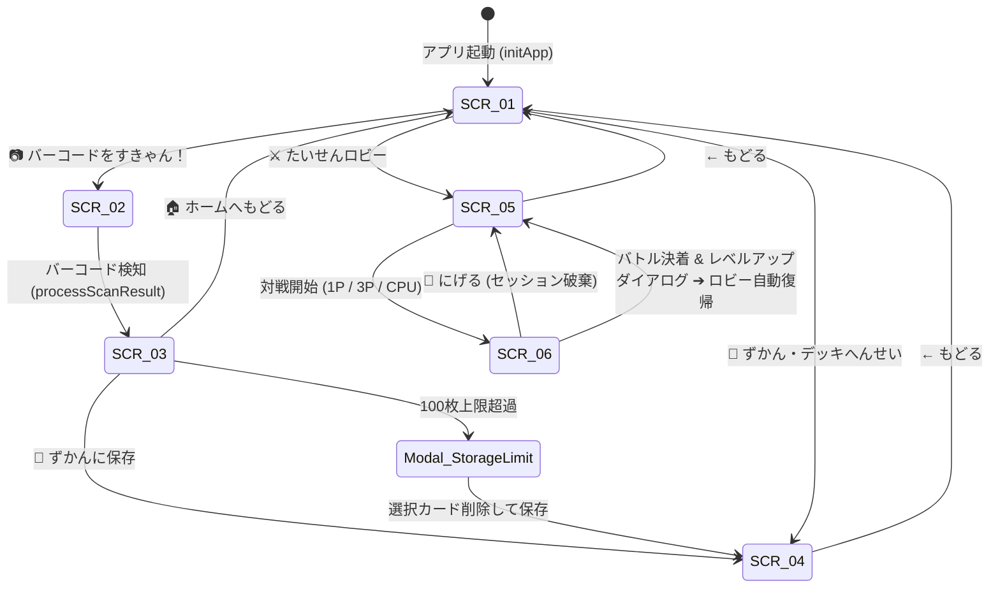

# 📐 システム基本設計書 (BASIC_DESIGN.md)

- **システム名**: バーコードバトラー Web アプリケーション
- **バージョン**: `v3.6.0` (3P Team Payload Fix & Robust Disconnect Handshake)
- **最終更新日**: 2026年8月15日
- **作成担当**: `software-engineer`

---

## 改定履歴 (Changelog)
- **v3.6.0 (2026-08-15)**:
  - 【不具合修正】3P対戦におけるゲストチーム送信ペイロード仕様（常に3体編成を送信）を是正し、フォールバックダミー生成時のキャラクター型保証ヘルパー（`getFallbackCharacter`）を追加してアイテムカード混入を根絶。
  - 【不具合修正】P2P対戦逃走・切断時において、`ESCAPE` メッセージ送信の遅延クリーンアップおよび多重切断検知による双方向の対戦ロビー自動復帰（`cleanupP2PAndReturnToLobby`）を堅牢化。
- **v3.5.0 (2026-08-15)**:
  - 【不具合修正】`StorageManager.getDeck()` において、デッキ内カードオブジェクトを図鑑コレクション（`collection`）の最新成長データで即時同期（Hydration）する仕様を追加。
  - 【新機能・改善】P2P対戦中における `ESCAPE` メッセージ通信および `close` / `error` イベント検知による強制終了・対戦ロビー復帰（`cleanupP2PAndReturnToLobby`）の例外制御仕様を追加。
- **v3.4.0 (2026-08-15)**:
  - 【新機能】SCR-04 所持図鑑画面において、デッキ選択中のカード（メイン・サブ・アイテム）を最上部（先頭）に優先ソートして表示する仕様・ロジックを追加。
- **v3.3.0 (2026-08-15)**:
  - 【改善】SCR-01 ホーム画面のレイアウトをモバイル実機（100dvh）に完全最適化。メインキャラ表示エリアの縦幅を圧縮（スプライト 92px、`max-height` 制御、余白最適化）し、下部ボタングループ（「ずかん・デッキへんせい」「たいせんロビー」）の見切れを完全解消。
  - 【改善】SCR-04 図鑑画面において、デッキ選択中キャラクターのLvバッジ表示位置をデッキ非選択キャラと同一の左上隅（`top: 5px; left: 5px;`）に統一。
- **v3.2.0 (2026-08-15)**:
  - 【改善】SCR-01 ホーム画面のメインキャラ表示エリア（`.char-showcase`）の縦幅をコンパクト化（スプライト 105px、余白最適化）。
  - 【新機能】SCR-01 ホーム画面のメインキャラ表示エリアに現在レベル（`Lv.XX`）をゴールドバッジで常時表示。
  - 【削除】SCR-04 図鑑カード一覧の「✅DECK」リボン表示を廃止・削除（デッキ採用判定は太線シアンボーダー `.is-deck-set` および右上スロットバッジで表現）。
- **v3.1.0 (2026-08-15)**:
  - 【改善】バーコード属性決定ロジックをハッシュ値均等分散（`Math.abs(hash) % 3`）に最適化。8桁・13桁バーコード問わず火・水・木の3属性が完全に均等（各33.3%）に出現するよう仕様・実装を更新。
- **v3.0.0 (2026-08-15)**:
  - 【新機能】レベル（LV）＆ 経験値（EXP）システム導入（最大Lv.100、累乗必要EXPカーブ、+1.5%/Lvステータス成長）。
  - 【新機能】3P対戦 出撃キャラクター限定EXP付与（案B）。
  - 【新機能】100枚超過時の削除選択モーダルUI（`#storage-limit-modal`）。
  - 【新機能】図鑑サブタブ3分類（すべて / キャラ / アイテム）。
  - 【改善】ガード時50%被ダメージ半減、レアリティ補正係数統一（SSR:1.50, SR:1.30, R:1.15, N:1.00）。

---

## 1. システム構成 & アーキテクチャ

```
+-----------------------------------------------------------------------------------+
|                                  Client Browser                                   |
|                                                                                   |
|   +---------------------------------------------------------------------------+   |
|   |                        UI / Router (HTML5 & Vanilla CSS)                  |   |
|   |   SCR-01 (Home) / SCR-02 (Scan) / SCR-03 (Result)                         |   |
|   |   SCR-04 (Collection/Deck) / SCR-05 (Lobby) / SCR-06 (Battle)             |   |
|   +---------------------------------------------------------------------------+   |
|                                         |                                         |
|   +---------------------------------------------------------------------------+   |
|   |                   JavaScript Engine (src/js/bundle.js)                    |   |
|   |                                                                           |   |
|   |  +---------------------+   +-------------------+   +-------------------+  |   |
|   |  |   BarcodeEngine     |   |  StorageManager   |   |   BattleEngine    |  |   |
|   |  | (JAN Hash/SVGs)     |   | (LocalStorage)    |   | (Turn Logic)      |  |   |
|   |  +---------------------+   +-------------------+   +-------------------+  |   |
|   |                                                                           |   |
|   |  +---------------------+   +-------------------------------------------+  |   |
|   |  |    LevelManager     |   |              NetworkManager               |  |   |
|   |  | (EXP & Level Curve) |   |    (PeerJS WebRTC / Host Authority)       |  |   |
|   |  +---------------------+   +-------------------------------------------+  |   |
|   |   +-----------------------------------------------------------------------+   |
|   +---------------------------------------------------------------------------+   |
|                                         |                                         |
+-----------------------------------------|-----------------------------------------+
                                          |
                      WebRTC P2P Data Channel (STATE_SYNC / GUEST_ACTION)
                                          |
+-----------------------------------------|-----------------------------------------+
|                                         v                                         |
|                                 Peer Client Device                                |
+-----------------------------------------------------------------------------------+
```

---

## 2. モジュール＆データ構造設計

### 2.1 データモジュール一覧 (`src/js/bundle.js`)

| モジュール名 | 役割・職務概要 |
|---|---|
| **`BarcodeEngine`** | JANコード（13桁/8桁）から確定的なハッシュ値を計算し、全20種族モンスターまたは8種強化アイテムのカードデータおよびSVGを決定論的に生成。属性決定は `elements[Math.abs(hash) % 3]` により火・水・木を各33.3%均等分散。 |
| **`StorageManager`** | LocalStorageへの図鑑データ（最大100枚）およびデッキ設定（メイン/サブ1/サブ2/アイテム1・2・3）の保存・更新・削除・100枚超過選択モーダル制御・自動マイグレーション。 |
| **`LevelManager`** | レベル（1〜100）および累乗必要EXP計算（$\lfloor 40 \times LV^{1.4} \rfloor$）、対戦後EXP付与、レベルアップ時ステータス再計算（+1.5%/Lv）の統括。 |
| **`BattleEngine`** | ターンの計算、1P(10T)/3P(20T)ルールの管理、素早さ連動途中交代（スイッチ）、ガード時被ダメージ半減（50%軽減）、3アイテム最大3回個別使用管理、出撃参加キャラ履歴の記録。 |
| **`NetworkManager`** | PeerJSを利用し、4桁のルームコードを用いた端末間WebRTC P2P接続の確立、STUN 5重冗長化、リトライハンドシェイク、Host Authority型確定ステート同期。 |
| **`History Router`** | `history.pushState` および `popstate` イベントの制御による、ブラウザ「戻る」ボタンでのアプリ内画面移動＆終了ダイアログ処理。 |

---

## 3. カード＆データスキーマ設計

### 3.1 キャラクターカードオブジェクト構造 (`Card`)
```typescript
interface CharacterCard {
  id: string;
  barcode: string;
  type: 'character';
  name: string;
  species: string;          // 全20種族
  element: '火' | '水' | '木';
  rarity: 'SSR' | 'SR' | 'R' | 'N';
  baseHp: number;
  baseAtk: number;
  baseDef: number;
  baseSpd: number;
  maxHp: number;           // レベル補正後の最大HP
  currentHp: number;
  atk: number;             // レベル補正後の攻撃力
  def: number;             // レベル補正後の防御力
  spd: number;             // レベル補正後の素早さ
  sp: number;              // 0 〜 100
  level: number;           // 1 〜 100
  exp: number;             // 現在の経験値
  skill: { name: string; desc: string };
  spriteSvg: string;
  memo?: string;
  createdAt: number;
}
```

### 3.2 アイテムカードオブジェクト構造 (`ItemCard`)
```typescript
interface ItemCard {
  id: string;
  barcode: string;
  type: 'item';
  name: string;
  rarity: 'SSR' | 'SR' | 'R' | 'N';
  effectType: 'heal' | 'buff_atk' | 'buff_def' | 'buff_spd' | 'charge_sp' | 'bomb' | 'heal_def' | 'all_buff';
  value: number;
  desc: string;
  spriteSvg: string;
  memo?: string;
  createdAt: number;
}
```

### 3.3 デッキ構造 (`DeckState`)
```typescript
interface DeckState {
  mainChar: CharacterCard | null;
  subChar1: CharacterCard | null;
  subChar2: CharacterCard | null;
  itemCard1: ItemCard | null;
  itemCard2: ItemCard | null;
  itemCard3: ItemCard | null;
}
```

---

## 4. グラフィック＆スプライト生成ロジック

### 4.1 属性マルチカラーパレット (`ELEMENT_PALETTES`)
```javascript
export const ELEMENT_PALETTES = {
  "火": { primary: "#ff2200", secondary: "#ffd700", dark: "#880011", eye: "#ffff00", pupil: "#000000", accent: "#ff6600" },
  "水": { primary: "#0088ff", secondary: "#e0ffff", dark: "#002266", eye: "#00ffff", pupil: "#ffffff", accent: "#00e5ff" },
  "木": { primary: "#00aa44", secondary: "#aaffaa", dark: "#003311", eye: "#ffff33", pupil: "#003300", accent: "#00ff88" }
};
```

### 4.2 レアリティ別背景演出 (`generateCharacterSvg`)
- **SSR**: 16芒サンバースト大光槍（`<polygon points="70,4 ...">`）＋ 黄金ルーン魔方陣 ＋ 星屑スパークル ＋ 黄金グラデーション
- **SR**: サイバーオーラ ＋ ヘックス幾何学グリッド（六角形）
- **R**: クリスタルリング ＋ エナジー粒子
- **N**: ディープネイビー円形ベースプレート ＋ アークティックライン

### 4.3 レアリティ別ステータス・効果補正係数
| レアリティ | 出現確率 | キャラ基礎ステータス補正 | アイテム効果補正 |
|---|:---:|:---:|:---:|
| **✨ SSR** | 3% | **$\times 1.50$** | **$\times 1.50$** |
| **🌟 SR** | 12% | **$\times 1.30$** | **$\times 1.30$** |
| **🔷 R** | 25% | **$\times 1.15$** | **$\times 1.15$** |
| **⚪ N** | 60% | **$\times 1.00$** | **$\times 1.00$** |

---

## 5. レベル（LV）＆ 経験値（EXP）成長ロジック (`LevelManager`)

### 5.1 必要経験値計算式
$$\text{NextEXP}(LV) = \lfloor 40 \times (LV)^{1.4} \rfloor$$

### 5.2 レベル補正ステータス計算式
$$\text{Status}(LV) = \text{BaseStatus} \times (1 + (LV - 1) \times 0.015)$$
- レベルアップ時に `maxHp`, `atk`, `def`, `spd` を動的に再計算してカードに反映。

### 5.3 出撃キャラ限定の経験値付与処理 (`grantBattleExp`)
- `BattleEngine` 内でバトル中に出撃したキャラクターIDセット（`participatedCardIds`）を追跡。
- P2P対戦終了時、勝利時は `+100 EXP`、敗北時は `+30 EXP` を出撃したカードにのみ付与（控えのまま出撃しなかったキャラは対象外）。
- 累積EXPが必要EXPに達した場合、レベルをインクリメントし複数レベルアップも再帰・ループで処理。
- 更新結果を `StorageManager` 経由で LocalStorage に永続保存。

### 5.4 既存データマイグレーション (`migrateCollectionData`)
- 保存データ読み込み時、`level` または `exp` が未定義のカードに対して `level: 1, exp: 0` を自動設定。

---

## 6. 3P対戦キャラクター交代 & 素早さ連動ダメージ処理 (`BattleEngine`)

### 6.1 コマンド優先度と行動順序
```typescript
interface ActionParam {
  action: 'attack' | 'skill' | 'guard' | 'item' | 'switch';
  itemIdx?: number;
  switchIdx?: number;
}
```

- **行動優先度（Priority）計算**:
  - **🛡️ ガード**: `9999`（最優先で発動し、**そのターンの被ダメージを50%半減**）
  - **⚔️ 攻撃 / ✨ 必殺技**: `spd * (0.85 + Math.random() * 0.3)`
  - **🔄 交代（switch）**: **出撃中キャラクターの** `spd * (0.85 + Math.random() * 0.3)`
  - **💊 アイテム**: `9000`

### 6.2 交代時の被ダメージシーケンス
- **相手が先攻の場合**:
  1. 相手の攻撃が発動 ➔ **交代前の出撃キャラクターがダメージを受ける**。
  2. 生存していれば、続いて予定通り控えキャラクターへと交代完了。
  3. （※被弾で倒れた場合は撃破交代へ移行）
- **自分が先攻の場合**:
  1. 自分の交代が先に発動 ➔ **指定した控えキャラクターが出撃**。
  2. 続いて相手の攻撃が発動 ➔ **新しく登場したキャラクターがダメージを受ける**。

---

## 7. P2P通信プロトコル＆同期シーケンス (Host Authority Pattern)

```mermaid
sequenceDiagram
    autonumber
    participant Guest as 🟢 ゲスト端末 (Client)
    participant Host as 🔴 ホスト端末 (Host Authority)

    Note over Guest, Host: PeerJS WebRTC P2P 接続確立 (STUN 5重冗長化)
    Guest->>Host: JOIN_ROOM { guestDeck, guestMode }
    Note over Host: ホストの公式ルール(1Pまたは3P)を確定
    Host->>Guest: START { hostDeck, mode, firstTurn }

    rect rgb(30, 40, 70)
        Note over Guest, Host: ターンコマンド入力
        Guest->>Host: GUEST_ACTION { action, itemIdx, switchIdx }
        Note over Host: ホストが processTurn(...) で一括判定<br/>(ダメージ・交代・HP・SP・勝敗を計算)
        Host->>Guest: STATE_SYNC { playerTeam, enemyTeam, playerIndex, enemyIndex, isOver, winner, turnLog }
    end

    Note over Guest: applyGuestState(payload) で100%完全同期復元
    Note over Host, Guest: バトル決着時: grantBattleExp(winner, participatedIds) 実行
```



---

## 8. UI/UX 画面状態遷移設計



---

## 9. 与ダメージ計算＆ゲームバランス設計

### 9.1 ダメージ計算式
$$\text{BaseDamage} = \text{ATK} \times 2.5 \times \left( \frac{100}{100 + \text{DEF} \times 0.35} \right)$$

- **🛡️ ガード時**: **被ダメージを50%半減**（$\text{Damage} \times 0.50$）。
- **✨ 必殺技倍率**: SP 100% 発動時 $\text{Damage} \times 1.85$。
- **属性相性倍率**: 有利属性（火 ➔ 木 ➔ 水 ➔ 火）で **1.5倍**。
- **最低保障貫通ダメージ**: $\text{ATK} \times 0.50$。

---

## 10. 非機能・エラーハンドリング設計

1. **100枚上限時の削除選択モーダル (`#storage-limit-modal`)**:
   - 自動FIFOではなく、ユーザーが削除対象カードを一覧から選択して入れ替えるUIを提供。
2. **スクリプト起動保護**: `document.readyState` チェックおよび `try-catch` ガード。
3. **自動マイグレーション (`migrateCollectionData`)**: 旧データ読み込み時に自動で `level: 1, exp: 0` を補完。
4. **ブラウザ「戻る」対策**: `history.pushState` と `popstate` イベントの連動。
