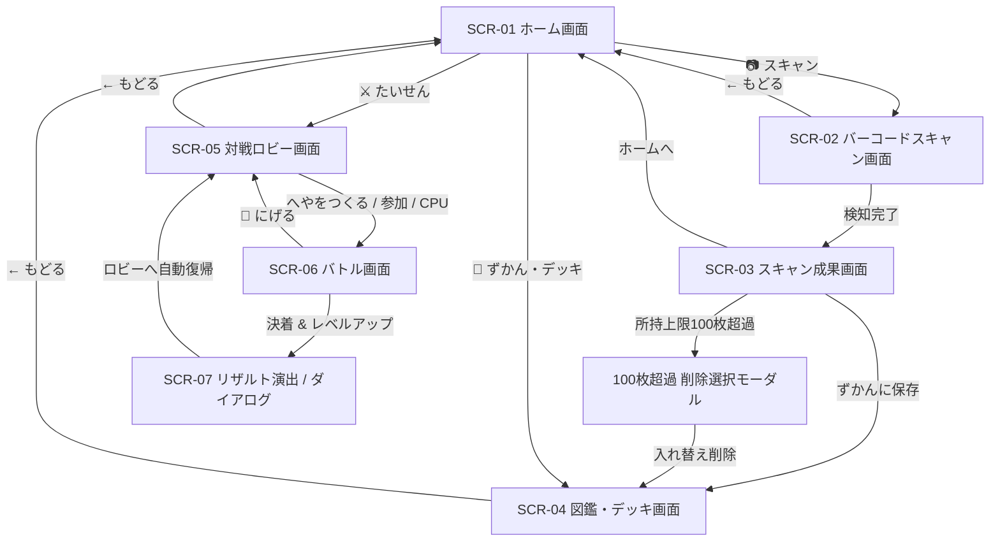

# 🎨 UI/UX デザイン仕様書 (UI_Design.md)

- **バージョン**: `v3.5.0` (Level Stat Sync & P2P Disconnect Recovery)
- **最終更新日**: 2026年8月15日
- **作成/改定担当**: `ux-engineer`

---

## 改定履歴 (Changelog)
- **v3.5.0 (2026-08-15)**:
  - 【不具合修正】SCR-01 ホーム画面のメインキャラ表示エリアにおいて、レベルアップ後の成長ステータス（HP, ATK, DEF, SPD）がリアルタイムに即時反映されるよう同期ロジックを修正。
  - 【新機能・改善】SCR-06 バトル画面において、相手が「にげる」を実行した際や通信切断が発生した際に強制終了ダイアログを表示し、対戦ロビー（`SCR-05`）へ自動遷移するUXフローを定義。
- **v3.4.0 (2026-08-15)**:
  - 【新機能】SCR-04 所持図鑑画面において、デッキ選択中のカード（メイン・サブ・アイテム）を最上部（先頭）に優先ソートして表示するレイアウト仕様を追加。
- **v3.3.0 (2026-08-15)**:
  - 【改善】SCR-01 ホーム画面のレイアウトをモバイル実機（100dvh）に完全最適化。メインキャラ表示エリアの縦幅を圧縮（スプライト 92px、`max-height` 制御、余白最適化）し、下部ボタングループ（「ずかん・デッキへんせい」「たいせんロビー」）の見切れを完全解消。
  - 【改善】SCR-04 図鑑画面において、デッキ選択中キャラクターのLvバッジ表示位置をデッキ非選択キャラと同一の左上隅（`top: 5px; left: 5px;`）に統一。
- **v3.2.0 (2026-08-15)**:
  - 【改善】SCR-01 ホーム画面のメインキャラ表示エリア（`.char-showcase`）の縦幅をコンパクト化（スプライト 105px、余白最適化）。
  - 【新機能】SCR-01 ホーム画面のメインキャラ表示エリアに現在レベル（`Lv.XX`）をゴールドバッジで常時表示。
  - 【削除】SCR-04 図鑑カード一覧の「✅DECK」リボン表示を廃止・削除（デッキ採用判定は太線シアンボーダー `.is-deck-set` および右上スロットバッジで表現）。
- **v3.1.0 (2026-08-15)**:
  - 【改善】バーコード属性決定ロジックをハッシュ値均等分散（`Math.abs(hash) % 3`）に最適化。
- **v3.0.0 (2026-08-15)**:
  - 【新機能】レベル（LV）＆ 経験値（EXP）システム導入（最大Lv.100、累乗必要EXPカーブ、+1.5%/Lvステータス成長）。
  - 【新機能】3P対戦 出撃キャラクター限定EXP付与（案B）。
  - 【新機能】100枚超過時の削除選択モーダルUI（`#storage-limit-modal`）。
  - 【新機能】図鑑サブタブ3分類（すべて / キャラ / アイテム）。
  - 【改善】ガード時50%被ダメージ半減、レアリティ補正係数統一（SSR:1.50, SR:1.30, R:1.15, N:1.00）。

---

## 1. デザインシステム & カラーパレット (Cyber Arctic Arcade)

### 1.1 基本カラー & タイポグラフィ
- **背景色**: ディープサイバーネイビー (`--bg-color: #0b0e1b; --surface-color: #161b30; --surface-card: #1f2642;`)
- **アクセント**: ネオンシアン (`#00e5ff`), ネオンピンク (`#ff0055`), アーケードゴールド (`#ffd700`)
- **フォント**: `M PLUS Rounded 1c` (700/800/900), `Outfit` (800/900)

### 1.2 属性別マルチカラー & エレメントドット
- **🔥 火 (Fire)**: メイン `#ff2200` / サブ `#ffd700` / 瞳 `#ffff00` / 属性丸印 `#ff3344 ●`
- **💧 水 (Water)**: メイン `#0088ff` / サブ `#e0ffff` / 瞳 `#00ffff` / 属性丸印 `#00e5ff ●`
- **🌲 木 (Wood)**: メイン `#00aa44` / サブ `#aaffaa` / 瞳 `#ffff33` / 属性丸印 `#00ff88 ●`
- **💀 戦闘不能**: `#888888 💀`

### 1.3 レアリティ別【発光オーラエフェクト】
- **✨ SSR**: 黄金の強烈な光輪オーラ (`box-shadow: 0 0 16px rgba(255, 215, 0, 0.75), inset 0 0 10px rgba(255, 215, 0, 0.3)`) ＋ 黄金放射グラデーション
- **🌟 SR**: 紫のミスティックオーラ (`box-shadow: 0 0 14px rgba(176, 102, 255, 0.65), inset 0 0 8px rgba(176, 102, 255, 0.25)`)
- **🔷 R**: 水色のサイバーオーラ (`box-shadow: 0 0 10px rgba(0, 229, 255, 0.5)`)
- **⚪ N**: シンプルシャドウ (`box-shadow: 0 2px 6px rgba(0, 0, 0, 0.4)`)

### 1.4 デッキ選択中【外枠囲み】仕様
- **外枠をしっかり太く囲う**: `border: 2.5px solid var(--secondary-cyan) !important;`（鮮やかなシアンフレーム）。
- **左上レベルバッジ**: `<span class="level-badge">Lv.XX</span>`（※デッキ選択・非選択問わず常に `top: 5px; left: 5px;` で同一位置に完全統一）。
- **右上役職バッジ**: `<span class="slot-badge">⚔️ メイン / 🛡️ サブ1 / 💊 アイテム1 等</span>`
- ※「✅DECK」リボンは廃止し、シアン太枠ボーダーでスマートに表現。

### 1.5 能力値・効果のハイコントラスト視認性トレイ
- **キャラクター能力値**: 暗色バートレイ（`background: rgba(0, 0, 0, 0.7); border: 1px solid rgba(255, 255, 255, 0.2);`）内に `[属性] HP 1600 ATK 240 DEF 120` を常時鮮明に表示。
- **アイテム効果**: ゴールド境界線付き暗色トレイ内に効果テキストを折り返し全文表示。

---

## 2. 全20系統モンスター & 8種アイテム ビジュアル定義

### 2.1 全20系統モンスター一覧
1. **ドラゴン** (鋭い角と巨大な翼)
2. **ゴーレム** (重厚な岩石ボディとツインアイ)
3. **ナイト** (聖騎士の盾と兜)
4. **フェニックス** (炎の翼と尾羽)
5. **タイガー** (雷虎の縞模様)
6. **スライム** (丸みボディと可愛い瞳)
7. **ベア** (迫力ある凶暴クマ)
8. **ロボ** (サイバーアンテナとメカアイ)
9. **ウルフ** (疾風の狼)
10. **ライオン** (百獣のたてがみ)
11. **イエティ** (氷雪の怪人)
12. **グリフォン** (鷲の翼と頭部)
13. **バトロボ** (重火器武装のバトルドロイド)
14. **クラーケン** (深海の触手巨大魔獣)
15. **ペガサス** (天馬の純白の翼)
16. **キマイラ** (三頭の合成魔獣)
17. **デーモン** (闇の角と悪魔の翼)
18. **レヴィアタン** (渦巻く大海蛇)
19. **ネクロマンサー** (髑髏と魔導フード)
20. **ファントム** (揺らめく幽霊・霊体)

### 2.2 8種アイテムSVG定義
- 💊 **えりくさー** (HP回復 +300 HP)
- ⚔️ **はかいのつるぎ** (ATKバフ +40 ATK)
- 🛡️ **いあつのたて** (DEFバフ +40 DEF)
- ⚡ **ひかりのたびびと** (SPDバフ +40 SPD)
- ✨ **びくとりーのたま** (SP即時100%充填)
- 💥 **まほうのばくだん** (相手に250固定ダメージ)
- 🧪 **ふ死鳥の水** (HP +200 & DEF +40)
- 👑 **おうかんの輝き** (ATK +30, DEF +30, SPD +30)

---

## 3. 画面一覧 & 画面遷移フロー (SCR-01 〜 SCR-07)



---

## 4. 画面レイアウト & ワイヤーフレーム

### SCR-01 [ホーム画面]
- ヘッダー: `⚡ バーコードバトラー` / 所持数バッジ `[しょじ 42/100]`
- メイン出撃キャラカード展示（縦幅コンパクト化：スプライト 105px、名前、属性タグ、ゴールドLvバッジ `Lv.XX`、レアリティバッジ、ステータス）
- メインボタン群: `[📷 バーコードをすきゃん！]`, `[📖 ずかん・デッキ]`, `[⚔️ たいせんロビー]`

### SCR-02 [バーコードスキャン画面]
- カメラプレビュー画面（`#camera-video`）、ネオン走査レーザーアニメーション。
- デモ用バーコードボタン（火ドラゴン、水タイガー、木ゴーレム、SSR、アイテム等）。
- 手動13桁/8桁バーコード入力欄とスキャン実行ボタン。

### SCR-03 [スキャン成果画面]
- ガチャ風カットイン演出、獲得カード（20種族キャラまたは8種アイテム）の展示。
- メモ入力フォーム、`[📖 ずかんに ほぞんする]`, `[🏠 ホームへ もどる]`。

### SCR-04 [図鑑 & デッキ編成画面]
```
+-------------------------------------------------+
| [← もどる]                     📖 ずかん・デッキ|
+-------------------------------------------------+
| [ 📖 所持ずかん (Active) ]   [ ⚔️ デッキへんせい ]|
+-------------------------------------------------+
| [ すべて ]    [ 👾 キャラクター ]    [ 💊 アイテム ]| (サブタブ切替)
| 👇 デッキセット中カードが最上部に優先ソート表示 |
| +---------------------+   +---------------------+ |
| | Lv.15   [⚔️メイン] |   | Lv.12    [🛡️サブ1] | | (★デッキ最優先表示)
| | (Mini-SVG)          |   | (Mini-SVG)          | |
| | [SSR] 爆炎ドラゴン  |   | [SR] 迅雷タイガー   | |
| | [火] HP1480 ATK220  |   | [水] HP1200 ATK180  | |
| +---------------------+   +---------------------+ |
| +---------------------+   +---------------------+ |
| |         [💊アイテム1]|   |         [💊アイテム2]| | (太線シアン枠)
| | (Mini-SVG)          |   | (Mini-SVG)          | |
| | ✨ [SSR] えりくさー |   | ⚔️ [SR] はかいのつるぎ| |
| | HPを 750 かいふく！ |   | ATKが 100 アップ！  | |
| +---------------------+   +---------------------+ |
| +---------------------+   +---------------------+ |
| |         [💊アイテム3]|   |                     | |
| | (Mini-SVG)          |   | (Mini-SVG)          | |
| | 💥 [R] まほう爆弾   |   | Lv.1 闇のデーモン   | |
| | 250 固定ダメージ！  |   | [火] HP1050 ATK150  | |
| +---------------------+   +---------------------+ |
+-------------------------------------------------+
```

#### カード詳細確認モーダル (`#detail-modal`)
```
+-------------------------------------------------+
|                [ カード詳細・育成 ]              |
+-------------------------------------------------+
|               (拡大スプライト SVG)              |
|          ✨ [SSR] 爆炎ドラゴン (火属性)         |
|              👑 現在レベル: Lv.15 / 100          |
|  EXP: 280 / 465 (60%)                           |
|  [████████████░░░░░░░░]                         |
|  HP: 1480  ATK: 220  DEF: 120  SPD: 80          |
|  メモ: 「ポテトチップスの箱」                   |
+-------------------------------------------------+
|  [⚔️ メインにセット]    [🛡️ サブ1にセット]      |
|  [🛡️ サブ2にセット]    [📝 メモをへんしゅう]    |
|  [🗑️ このカードを削除]  [ ✖ とじる ]            |
+-------------------------------------------------+
```

### SCR-05 [対戦ロビー画面]
- ルール切り替えスイッチ（`1P対戦` / `3P対戦`）。
- 部屋作成エリア（4桁ランダム英数字のホストコード大文字表示）。
- 部屋参加エリア（4桁コード入力欄、※ロビー復帰時に自動クリア）。
- 「ひとりでCPU対戦テスト」ボタン。

### SCR-06 [バトル画面 (ノースクロール完全対応)]
```
+-------------------------------------------------+
| ⚔️ バトル                               [🏃 にげる]|
+-------------------------------------------------+
| 🔴 あいて: [SSR] アクアタイガー Lv.20 (水)       |
| HP: 820/1600  [████████░░░░░░]  SP: [████░░░░]  |
| +---------------------------------------------+ |
| | [●水]タイガー 820/1600 | [●火]竜 1200 | [💀]犬 0 | | (3Pサブスロット)
| +---------------------------------------------+ |
+-------------------------------------------------+
|      (あなた)                   (あいて)        |
|      [ 爆炎竜 ]        VS       [ 氷晶虎 ]      |
+-------------------------------------------------+
| 🟢 あなた: [SSR] 爆炎ドラゴン Lv.25 (火)         |
| HP: 1450/1920 [████████████░░]  SP: [████████]  | (100% READY)
| +---------------------------------------------+ |
| |👑[●火]竜 1450/1920 | [●水]虎 1100 | [●木]人 900| | (出撃中金枠)
| +---------------------------------------------+ |
+-------------------------------------------------+
| [実況ログ: 爆炎ドラゴンの こうげき！ 280ダメージ]|
+-------------------------------------------------+
| [ ⚔️ こうげき ]    [ ✨ ひっさつ ]    [ 🛡️ ガード ]|
| [ 💊 アイテム (3/3) ]             [ 🔄 こうたい ]|
+-------------------------------------------------+
```

---

## 5. モーダル・ダイアログ仕様

### 5.1 100枚超過時 削除選択モーダル (`#storage-limit-modal`)
所持上限（100枚）に達した状態で新規カードを保存しようとした場合に表示：
- タイトル: `⚠️ 所持上限（100枚）に達しています`
- 説明: `新しくカードを保存するには、お別れするカードを1枚選んでください。`
- リスト: 所持している全100枚のミニカード一覧（タップで選択）。
- ボタン: `[🗑️ このカードを削除して保存]`, `[キャンセル]`

### 5.2 アイテム選択モーダル (`#battle-item-modal`)
バトル中「💊 アイテム」タップ時に表示：
- セットされている3つのアイテム名・効果・残り使用可否を表示し、タップで発動。

### 5.3 キャラクター交代モーダル (`#battle-switch-modal`)
3P対戦中「🔄 こうたい」タップ時に表示：
- 生存している控えキャラクターの属性丸印（●）、名前、Lv、残りHP/最大HPを表示し、ワンタップで交代先を選択。

### 5.4 バトル決着・レベルアップ通知ダイアログ
P2P対戦終了時に表示：
- `🎉 あなたの 勝利！`（または `💧 敗北...`）
- `⚔️ バトル参加ボーナス: +100 EXP 獲得！`
- `✨ 爆炎ドラゴン が Lv.25 ➔ Lv.26 に レベルアップ！`
  `(HP: 1450 ➔ 1472, ATK: 220 ➔ 223, DEF: 120 ➔ 122, SPD: 80 ➔ 81)`

---

## 6. モーション & 演出仕様 (Motion Design)
- **スキャンカットイン**: 暗転 ➔ レアリティオーラ発光 ➔ カード拡大バウンド ➔ ステータスカウントアップ (1.2s)。
- **被弾シェイク**: 被弾時に `200ms` の左右振動アニメーション。
- **SP100%パルス**: 必殺技発動可能時にゴールドの脈動光エフェクト。
- **レベルアップファンファーレ**: レベルアップ時にゴールドスパークルエフェクトとともに能力上昇通知を表示。

---

## 7. モバイル固有配慮
- `env(safe-area-inset-top/bottom)` の適用によるノッチ・ホームバー保護。
- 縦画面固定・ノースクロール設計（スマートフォンで1画面完結）。
