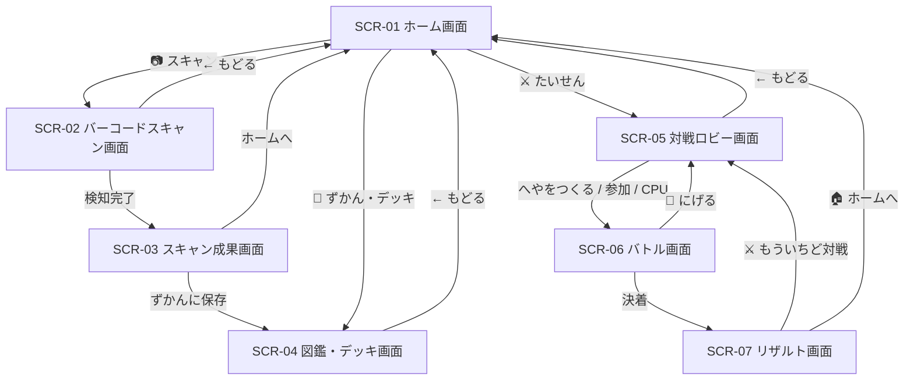

# 🎨 バーコードバトラー (Barcode Battler) - UI/UX デザイン仕様書 (統合版)

**ドキュメントバージョン**: v2.3.0 (仕様改定版)  
**最終更新日**: 2026年8月15日  
**ステータス**: 要件レビュー中 (Under Review)  
**対象プラットフォーム**: モバイルWeb / PC Web (PWA / レスポンシブ対応)  

---

## 1. デザインコンセプト & デザインシステム

### 1.1 デザインコンセプト: **「Cyber Arctic Arcade (サイバー・アークティック・アーケード)」**
- 濃紺の宇宙ダークモード（ディープサイバーネイビー `#0b0e1b`）を基調とし、ネオンピンク（`#ff0055`）、ネオンシアン（`#00e5ff`）、アクセントゴールド（`#ffea00`）が鮮やかに映える近未来アーケードスタイル。
- テキストはひらがな中心（ふりがな付き）、ボタンは最小 48dp $\times$ 48dp の超大型タッチターゲット。

### 1.2 全20系統モンスター & 8種アイテム ビジュアル定義

#### ① 20系統モンスター一覧
1. **ドラゴン** (鋭い角と翼)
2. **ゴーレム** (重厚な岩石ボディとツインアイ)
3. **ナイト** (聖騎士の盾と兜)
4. **フェニックス** (炎の翼)
5. **タイガー** (雷虎の縞模様)
6. **スライム** (可愛い瞳と丸みボディ)
7. **ベア** (迫力ある凶暴クマ)
8. **ロボ** (サイバーアンテナ)
9. **ウルフ** (疾風の狼)
10. **ライオン** (百獣のたてがみ)
11. **イエティ** (氷雪の怪人)
12. **グリフォン** (鷲の翼と頭部)
13. **バトロボ** (重火器武装のバトルドロイド)
14. **クラーケン** (深海の触手巨大魔獣)
15. **ペガサス** (天馬の純白の翼)
16. **キマイラ** (三頭の合成魔獣)
17. **デーモン** (闇の角と悪魔の翼)
18. **レヴィアタン** (渦巻く大海蛇)
19. **ネクロマンサー** (髑髏と魔導フード)
20. **ファントム** (揺らめく幽霊・霊体)

#### ② 8種アイテムSVG定義
💊 **えりくさー** (回復), ⚔️ **はかいのつるぎ** (ATKバフ), 🛡️ **いあつのたて** (DEFバフ), ⚡ **ひかりのたびびと** (SPDバフ), ✨ **びくとりーのたま** (SP即時MAX), 💥 **まほうのばくだん** (固定ダメージ), 🧪 **ふ死鳥の水** (回復+DEF), 👑 **おうかんの輝き** (全能力バフ)。

---

## 2. 画面一覧 & 画面遷移フロー (SCR-01 〜 SCR-07)



---

## 3. 画面レイアウト & ワイヤーフレーム

### SCR-01 [ホーム画面]
- ヘッダー: `⚡ バーコードバトラー` / 所持数バッジ `[しょじ 42/100]`
- メイン出撃キャラカード表示（大迫力SVG、名前、属性タグ、SSRレアリティバッジ、ステータス）
- メインボタン群: `[📷 バーコードをすきゃん！]`, `[📖 ずかん・デッキ]`, `[⚔️ たいせんロビー]`

### SCR-02 [バーコードスキャン画面]
- カメラ映像プレビュー & ネオン走査レーザー
- カメラ起動ボタン、手動JAN入力フォーム、デモ用テストバーコード4種

### SCR-03 [スキャン成果画面]
- ガチャ風カットイン演出、獲得カード（20種族キャラまたは8種アイテム）の表示
- メモ入力フォーム、`[📖 ずかんに ほぞんする]`, `[🏠 ホームへ もどる]`

### SCR-04 [図鑑 & デッキ編成画面]（★アイテム3種ハイライト仕様）
```
+-----------------------------------+
| [← もどる]        📖 ずかん・デッキ|
+-----------------------------------+
| [ 📖 所持ずかん (Active) ] [ ⚔️ デッキへんせい ] |
+-----------------------------------+
| [すべて] [👾 キャラ] [🎁 アイテム]  | (サブタブ切替)
| 👇 カードをタップで詳細・セット・削除|
| +-------------+   +-------------+ |
| |[⚔️メイン]    |   |[🛡️サブ1]    | |
| | (Mini-SVG)  |   | (Mini-SVG)  | |
| | 爆炎ドラゴン |   | 迅雷タイガー | |
| | [SSR] HP1920|   | [SR] HP1550 | |
| +-------------+   +-------------+ |
| +-------------+   +-------------+ |
| |[💊アイテム1] |   |[💊アイテム2]| | (★3種ともハイライト枠線)
| | (Mini-SVG)  |   | (Mini-SVG)  | |
| | ✨えりくさー |   | ⚔️はかいの剣 | |
| | [SSR] HP+750|   | [SR] ATK+100| |
| +-------------+   +-------------+ |
| +-------------+   +-------------+ |
| |[💊アイテム3] |   |             | | (★3つ目のアイテムも枠線)
| | (Mini-SVG)  |   | (Mini-SVG)  | |
| | 💥まほう爆弾 |   | 闇のデーモン | |
| | [R] DMG 250 |   | [N] HP1050  | |
| +-------------+   +-------------+ |
+-----------------------------------+
```

#### デッキ編成タブ (View-Deck-Tab)
- 【メインキャラ (出撃)】
- 【サブキャラ 1 (3P用)】
- 【サブキャラ 2 (3P用)】
- **【強化アイテム 1】**: セット中アイテム名・効果
- **【強化アイテム 2】**: セット中アイテム名・効果
- **【強化アイテム 3】**: セット中アイテム名・効果

### SCR-05 [対戦ロビー画面]
- 1P / 3P 対戦ルール選択
- `[🏠 へやをつくる (コードはっこう)]`, `[🔑 4桁コード入力 ➔ さんかする]`, `[🤖 ひとりで CPU対戦テスト]`

### SCR-06 [バトル画面]（★アイテム選択モーダル対応）
```
+-----------------------------------+
| ⚔️ バトル                  [🏃 にげる]|
+-----------------------------------+
| 🔴 あいて: アクアタイガー  HP: 820/1600|
| HP [████████░░░░░░]  SP [████░░░░]|
+-----------------------------------+
|   (あなた)               (あいて)  |
|   [ 爆炎竜 ]     VS     [ 氷晶虎 ] |
+-----------------------------------+
| 🟢 あなた: 爆炎ドラゴン  HP: 1450/1920|
| HP [████████████░░]  SP [████████]| (100% READY)
+-----------------------------------+
| [バトル実況ログ: えりくさーを使用！HP回復]|
+-----------------------------------+
| [ ⚔️ こうげき ]   [ ✨ ひっさつ ]   |
| [ 🛡️ ガード   ]   [ 💊 アイテム(3/3)]|
+-----------------------------------+
```
- ※ `💊 アイテム` ボタンタップ時、セットした3つのアイテムから選択するポップアップが表示されます：
  - `[💊 ① えりくさー (HP+750)]`
  - `[⚔️ ② はかいのつるぎ (ATK+150)]`
  - `[💥 ③ まほうのばくだん (500固定DMG)]`
  - （使用済みスロットは「使用済」として非活性化）

### SCR-07 [リザルト画面]
- 勝敗巨大タイトル（`🎉 あなたの しょうり！` / `💧 あなたの まけ...`）
- バトルサマリー（経過ターン数、総ダメージ、残HP、MVPキャラ）
- `[⚔️ もういちど たいせんする]`, `[🏠 ホームへ もどる]`

---

## 4. モーダル・ダイアログ仕様

### 4.1 カード詳細 & デッキセットモーダル
アイテムカードをタップした際、セット先スロットを選択可能：
- `[📝 メモをへんしゅう]`
- `[💊 アイテム1にセット]`
- `[💊 アイテム2にセット]`
- `[💊 アイテム3にセット]`
- `[🗑️ このカードを さくじょ]`
- `[とじる]`

### 4.2 削除確認ダイアログ & 通信切断ダイアログ
- カード削除時、セット中の場合は「デッキからも解除されます」の警告付き確認ダイアログを表示。
- 通信切断時、「あいての つうしんが きれました。あなたの ふせんしょう です！」ダイアログを表示しリザルトへ。

---

## 5. モーション & 演出仕様 (Motion Design)
- **スキャンカットイン**: 暗転 ➔ レアリティ発光 ➔ カード拡大バウンド ➔ 数値カウントアップ (1.2s)。
- **被弾シェイク**: 被弾時に `200ms` の左右振動アニメーション。
- **SP100%パルス**: ゴールドの脈動光エフェクトで必殺技発動可能をアピール。

---

## 6. モバイル固有配慮
- `env(safe-area-inset-top/bottom)` の適用によるノッチ・ホームバー保護。
- 縦画面固定推奨ガイダンス（横画面時に案内オーバーレイを表示）。
