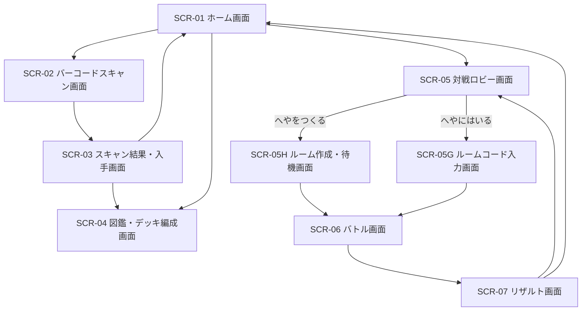

# 🎨 UI/UX デザイン仕様書 (バーコード対戦スマホアプリ)

## 1. デザイン基本方針 & テーマ

- **デザインコンセプト**: **「Cyber Arcade Pop (ネオン・アーケード・ポップ)」**
  - 小中学生がワクワクするようなアーケードゲーム調のネオンカラーとダイナミックなカットイン演出。
  - テキストは直感的に理解できる**ひらがな中心（カタカナ・漢字はふりがな付き）**、ボタンやステータスは大きめのアイコンとプロポーションで構成。
- **カラーパレット**:
  - **Primary**: `#FF3366` (ネオンピンク / 決定・熱血攻撃)
  - **Secondary**: `#00E5FF` (シアンブルー / 水属性・必殺技)
  - **Accent**: `#FFD700` (ゴールド / レアリティSSR・一発逆転)
  - **Element Fire**: `#FF4500` (火属性カラー)
  - **Element Water**: `#1E90FF` (水属性カラー)
  - **Element Wood**: `#32CD32` (木属性カラー)
  - **Background**: `#121420` (ダークサイバーネイビー / 液晶映え・バッテリー省電力)
  - **Surface/Card**: `#1E2238` (カードフレーム・モーダル背景)
  - **Text Main**: `#FFFFFF` / **Text Muted**: `#A0A8C0`
- **タイポグラフィ**:
  - メインフォント: 『M PLUS Rounded 1c』, 『Noto Sans JP』 (丸みのあるポップなフォント)
  - 数値・ダメージ用: 『Outfit』, 『Press Start 2P』 (アーケード風フォント)

---

## 2. 画面遷移フロー (User Flow)



---

## 3. 画面レイアウト & ワイヤーフレーム

### SCR-01 [ホーム画面]
- **概要・目的**: アプリ起動後のメイン拠点。「すきゃん」「ずかん」「たいせん」の各メイン機能へ1タップで遷移。
- **主要コンポーネント**:
  - ヘッダー: アプリロゴ、所持キャラ数（例: 42/100）
  - メイン領域: お気に入りキャラの3D/2Dダイナミック表示
  - 大型アクションボタン3種（ネオンカラー・立体グラデーション）
- **レイアウト構造**:
  ```
  +-----------------------------------+
  | [Logo: バーコードバトラー]  [所持 42/100] |
  +-----------------------------------+
  |                                   |
  |       /\_/\   (看板キャラ演出)     |
  |      ( o.o )  [火属性 / SSR]       |
  |       > ^ <   「たたかうぞ！」      |
  |                                   |
  +-----------------------------------+
  |  [ 📷 バーコードをすきゃん！ ]     | (Primary Pink: 超大型)
  |                                   |
  |  [ 📖 ずかん・デッキ ]  [ ⚔️ たいせん ] | (Cyan / Gold: 大型)
  +-----------------------------------+
  ```
- **マイクロインタラクション**:
  - 看板キャラをタップするとジャンプアニメーションとボイス/効果音。
  - スキャンボタンはネオンのパルス（脈動）光エフェクト。

---

### SCR-02 [バーコードスキャン画面]
- **概要・目的**: スマホのカメラでJANコードを読み取る。
- **主要コンポーネント**:
  - カメラプレビュー領域
  - スキャンガイド枠（四角いレティクルとレーザー走査線アニメーション）
  - フラッシュライト切替ボタン、戻るボタン
  - ヒントテキスト: 「バーコードを わくの中に あわせよう！」
- **レイアウト構造**:
  ```
  +-----------------------------------+
  | [← もどる]         [💡 ライト ON]  |
  +-----------------------------------+
  |                                   |
  |       +-------------------+       |
  |       | ┌               ┐ |       |
  |       |   [JANバーコード]   |       |
  |       |   ================| (レーザー走査)
  |       | └               ┘ |       |
  |       +-------------------+       |
  |   「バーコードを わくの中に あわせよう！」 |
  |                                   |
  +-----------------------------------+
  ```

---

### SCR-03 [スキャン結果・入手画面]
- **概要・目的**: スキャンして生成されたキャラクター/強化アイテムの成果表示。ガチャ風カットイン演出。
- **主要コンポーネント**:
  - レアリティ別演出（SSR: 金の稲妻+演出音、SR: 銀光、R/N: 青/白光）
  - キャラクターカード（属性アイコン、名前、HP/ATK/DEF/SPD、固有Skill）
  - 強化アイテムが出出た場合の「アイテムカード」表示
  - メモ入力欄: 「スキャンした商品の名前をめも（例: ポテトチップス）」
  - アクションボタン: 「ずかんへ」「もういちど すきゃん」
- **レイアウト構造**:
  ```
  +-----------------------------------+
  |           ✨ SSR 獲得！ ✨        |
  +-----------------------------------+
  |  +-----------------------------+  |
  |  | [🔥 火] 爆炎ドラゴン         |  |
  |  | HP: 1850    ATK: 240        |  |
  |  | DEF: 110    SPD: 85         |  |
  |  | Skill: ギガフレア (敵全体大火傷)| |
  |  +-----------------------------+  |
  |                                   |
  |  [📝 メモ: おかしの箱        ]    |
  |                                   |
  |  [ 📖 ずかんに入れる ]  [ 📷 つぎ ]  |
  +-----------------------------------+
  ```

---

### SCR-04 [図鑑・デッキ編成画面]
- **概要・目的**: 所持キャラ（最大100体）の閲覧、メモ編集、バトル用デッキ（キャラ1〜3体＋アイテム1枚）の編成。
- **主要コンポーネント**:
  - タブ切替: 「所持キャラ一覧 (42/100)」「デッキ編成」
  - フィルタ/ソート: 属性別、レアリティ順、SPD順
  - キャラカードグリッド表示（タップで詳細＆メモ編集ダイアログ）
  - デッキスロット（メインキャラ、サブキャラ1・2、強化アイテム）
- **レイアウト構造**:
  ```
  +-----------------------------------+
  | [←]  [ ずかん (42/100) ]  [ デッキ ] |
  +-----------------------------------+
  | [すべて] [🔥火] [💧水] [🌲木] [ソート▼] |
  +-----------------------------------+
  | +-------+ +-------+ +-------+     |
  | |SSR 爆炎| |SR カメ| |R ポチ |     |
  | |[メモ📝]| |[メモ📝]| |[メモ📝]|     |
  | +-------+ +-------+ +-------+     |
  | +-------+ +-------+ +-------+     |
  | |SSR 迅雷| |N ネコ | |ITM 薬草|     |
  | +-------+ +-------+ +-------+     |
  +-----------------------------------+
  | [ ⚔️ このデッキで たいせんへ！ ]    |
  +-----------------------------------+
  ```

---

### SCR-05 [対戦ロビー画面]
- **概要・目的**: ルーム作成（ホスト）またはルーム参加（ゲスト）を選択。
- **主要コンポーネント**:
  - 「へやをつくる (ルームコード発行)」ボタン
  - 「へやにはいる (4桁コード入力)」ボタン
  - 4桁テンキー入力モーダル
  - 接続待機中スピナー・ルームコード大きく表示（例: `7 8 2 1`）
- **レイアウト構造 (待機画面)**:
  ```
  +-----------------------------------+
  | [← もどる]        [対戦ロビー]     |
  +-----------------------------------+
  |                                   |
  |     友達に このコードを おしえよう！   |
  |                                   |
  |      +---------------------+      |
  |      |   7   8   2   1     |      | (超特大ネオン表示)
  |      +---------------------+      |
  |                                   |
  |     🌀 相手の参加を まっています...  |
  |                                   |
  +-----------------------------------+
  ```

---

### SCR-06 [バトル画面]
- **概要・目的**: リアルタイム対戦の本番画面。ターン制でコマンドを選択。
- **主要コンポーネント**:
  - 画面上部: 相手キャラ（HPバー、属性、状態異常）
  - 画面中央: 3D/2Dバトルフィールド、技・ダメージ演出テキスト（「MISS!」「CRITICAL!」）
  - 画面下部: 自分キャラ（HPバー、SPゲージ[0〜100%]、コマンド4種）
  - コマンドボタン:
    1. **こうげき** (通常攻撃)
    2. **ひっさつ** (SP100%時解放)
    3. **ガード** (ダメージ50%カット+SP獲得)
    4. **ぎゃくてん** (QTE発動・1バトル1回)
- **レイアウト構造**:
  ```
  +-----------------------------------+
  | [敵] 💧 アクアタイガー  HP: [████░░] |
  +-----------------------------------+
  |                                   |
  |           VS  (フィールド)        |
  |      「MISS!」 / 「142 ダメージ!」  |
  |                                   |
  +-----------------------------------+
  | [自分] 🔥 爆炎ドラゴン HP: [██████] |
  | SPゲージ: [██████████] 100% (READY) |
  +-----------------------------------+
  | [ ⚔️ こうげき ]   [ ✨ ひっさつ ]   |
  | [ 🛡️ ガード   ]   [ 💥 ぎゃくてん ]  |
  +-----------------------------------+
  ```
- **QTE演出 (ぎゃくてんコマンド時)**:
  - 画面中央に左右に動くタイミングバーが出現。「ENTER (決定)」タップで中央のゴールドエリアに止められれば大成功（2.5倍ダメージ）。

---

### SCR-07 [リザルト画面]
- **概要・目的**: 勝敗結果の発表とログ表示。
- **主要コンポーネント**:
  - 勝敗巨大テキスト（「🎉 かち！ (VICTORY)」 / 「💧 まけ... (LOSE)」）
  - 対戦サマリー: 経過ターン数、総ダメージ、MVPキャラクター
  - アクションボタン: 「もういちど 対戦」「ロビーへ もどる」

---

## 4. モバイル (Android/iOS) & Web 固有の配慮

- **アクセシビリティ & タッチ設計**:
  - 全ボタンの最小タップ領域を **48dp x 48dp 以上** に設定。
  - テキストはひらがなメイン。小中学生が直感的に押せるデカボタン仕様。
- **演出 & フィードバック**:
  - コマンド決定時や攻撃ヒット時にスマホのバイブレーション（Haptic Feedback）を作動。
- **通信断・例外ハンドリング**:
  - 対戦中に相手の接続が切れた場合、「あいての つうしんが きれました」ダイアログを表示し、不戦勝処理として安全にロビーへ戻る。
